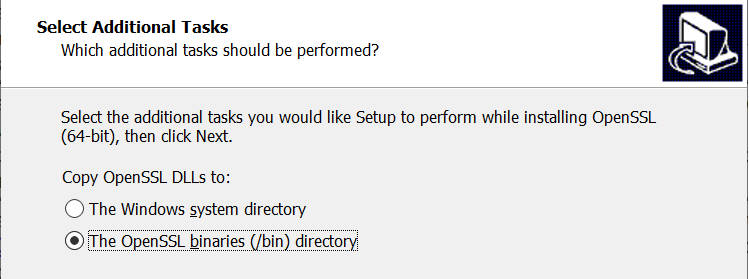
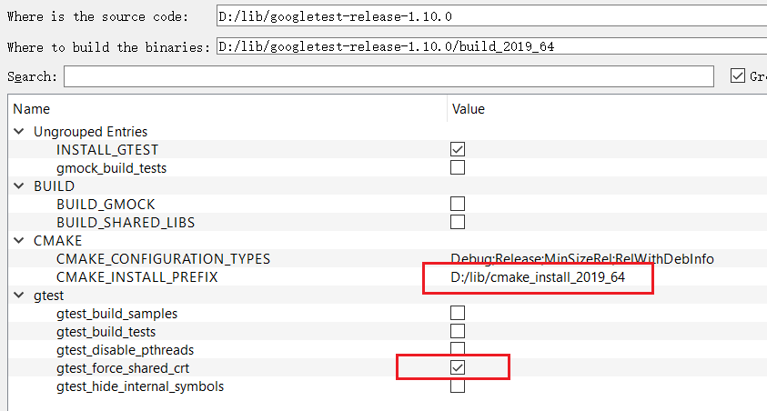
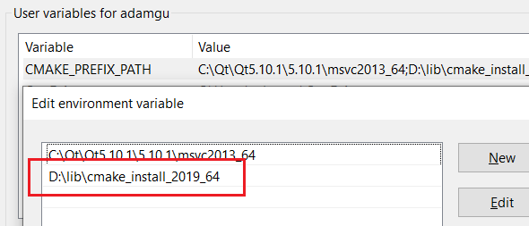
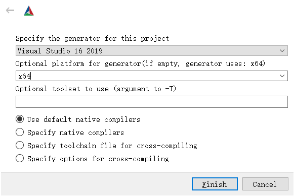

# Build on Windows

I'm using [Visual Studio 2019 Community](https://visualstudio.microsoft.com/vs/community/), but I think VS2017 should be OK, too.

Webcc depends on `std::filesystem` which is a C++17 feature. There's a branch ([legacy](https://github.com/sprinfall/webcc/tree/legacy)) which is still using `boost::filesystem` so it could be built with even VS2013.

## Install Boost

Download the `.7z` or `.zip` from [here](https://www.boost.org/users/download/#live). Unpack it.

Open `x64 Native Tools Command Prompt for VS 2019` from Windows start menu (suppose you are only interested in a x64 build).

In the prompt, `cd` to the Boost root directory. Run `bootstrap.bat` to generate `b2.exe`:

Run `b2.exe` to start the build:

```
b2 --with-system --with-date_time --with-filesystem variant=debug variant=release link=static threading=multi address-model=64 stage
```

NOTE: Given `address-model=64` `b2.exe` will not build any x86 libraries.

As you can see, we only need to build `system`, `date_time` and `filesystem`. Asio itself is a header-only library.

We don't install Boost to any other place (e.g., `C:\Boost`). We just `stage` it where it is.

In order for CMake to find Boost, please add an environment variable named `Boost_ROOT` pointing to the root directory of Boost.

## Install OpenSSL

Download from [here](http://slproweb.com/products/Win32OpenSSL.html).

The following installers (the suffix "g" might change according to revision) are recommended for development:

- Win64 OpenSSL v1.1.1g
- Win32 OpenSSL v1.1.1g

During the installation, you will be asked to copy OpenSSL DLLs (`libcrypto-1_1-x64.dll` and `libssl-1_1-x64.dll`) to "The Windows system directory" or "The OpenSSL libraries (/bin) directory". If you choose the later, remember to add the path (e.g., `C:\Program Files\OpenSSL-Win64\bin`) to the `PATH` environment variable.



OpenSSL can also be statically linked (see `C:\Program Files\OpenSSL-Win64\lib\VC\static`), but it's not recommended. Because the static libraries might not match the version of your VS.

The only drawback of dynamic link is that you must distribute the OpenSSL DLLs together with your program.

## Install Zlib

Download Zlib from https://www.zlib.net/.

Use CMake to generate VS solution. Click _**Configure**_ button.

By default, `CMAKE_INSTALL_PREFIX` points to a folder like `C:/Program Files (x86)/zlib` which is not what we want.

Change `CMAKE_INSTALL_PREFIX` to a folder where you would like to install all the third party libraries. E.g., `D:/lib/cmake_install_2019_64` (NOTE: you must use "/" instead of "\\" as path seperator!).

Remove all the `INSTALL_XXX_DIR` entries. Click _**Configure**_ button again. Now the `INSTALL_XXX_DIR` entries point to the folder defined by `CMAKE_INSTALL_PREFIX`.

Leave all other options untouched, click _**Generate**_ button to generate the VS solution.

Launch the VS solution and build `INSTALL` project for both Debug and Release.

Zlib should now have been installed to the given folder.

In order for CMake to find Zlib during the configuration of Webcc, please add an environment variable named `CMAKE_PREFIX_PATH` which points to the CMake install directory.

## Install Googletest

Download the latest release of [Googletest](https://github.com/google/googletest/releases).

Use CMake to generate VS solution:



Please note the highlighted configurations.

The `CMAKE_INSTALL_PREFIX` has been changed to `D:/lib/cmake_install_2019_64` (NOTE: please use "/" instead of "\\" as path seperators!). This path should be added to an environment variable named `CMAKE_PREFIX_PATH`. Then, CMake can find this installed Googletest during the configuration of Webcc.



After build Googletest in VS, install it by building `INSTALL` project from the whole solution.

## Build Webcc

Open CMake, set **Where is the source code** to Webcc root directory (e.g., `D:/github/webcc`), set **Where to build the binaries** to any directory (e.g., `D:/github/webcc/build_2019_64`).

Check _**Grouped**_ and _**Advanced**_ two check boxes.

Click _**Configure**_ button, select the generator and platform (`win32` or `x64`) from the popup dialog.



In the center of CMake, you can see a lot of configure options which are grouped. Change them according to your need. E.g., set `WEBCC_ENABLE_SSL` to `1` to enable OpenSSL.


Click _**Configure**_ button again. OpenSSL should be found.


Click _**Configure**_ button again. If everything is OK, click _**Generate**_ button to generate the VS solution.

Click _**Open Project**_ button to open VS.

Enjoy the build!
